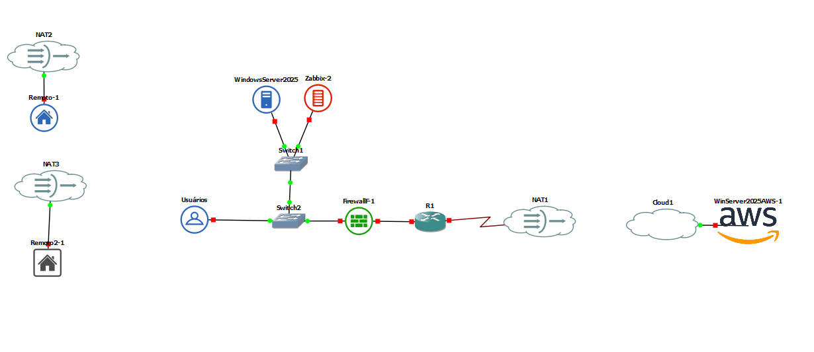

# 📌 1. O levantamento de requisitos estabelece a fundação da arquitetutura híbrida.

Implementação de uma infraestrutura de **Cloud Híbrida**, integrando ambiente **on-premises** com a nuvem 

O cenário simula uma pequena empresa com usuários internos, acesso remoto seguro e integração com a nuvem para backup e continuidade do negócio.

---

## 🏢 Ambiente Local (On-Premises)

- 13 estações integradas ao domínio  
- 3 impressoras de rede  
- 1 servidor **Windows Server 2022**  
- **Active Directory**  
- File Server com controle de permissões  
- Autenticação e gerenciamento centralizado de usuários  

Responsável por identidade, autenticação e armazenamento principal de arquivos.

---

## 🌐 Acesso Remoto

### 👤 Usuário 1 – VDI
- Acesso via **Virtual Desktop Infrastructure (VDI)**  
- Processamento no ambiente local  
- Conexão segura via **FortiClient VPN**  

### 👤 Usuário 2 – VPN
- Acesso remoto à rede corporativa  
- Autenticação via domínio  
- Conexão segura com **FortiClient VPN**  

---

## ☁️ Integração com AWS

- Conectividade entre rede local e VPC na AWS  
- Backup em nuvem  
- Suporte à continuidade do negócio  
- Expansão futura para novos serviços  

Comunicação via **VPN Site-to-Site**, garantindo tráfego seguro entre os ambientes.

---

# 📌 2. A montagem do ambiente local estrutura a base física da rede

O laboratório representa uma arquitetura de infraestrutura híbrida integrando ambiente local (on-premises), usuários remotos e ambiente em nuvem.

A topologia foi projetada para simular o funcionamento de uma pequena empresa com controle centralizado, monitoramento, acesso remoto seguro e integração com cloud computing.

---

## 🏢 Ambiente Local (On-Premises)

A infraestrutura interna é composta por:

### 🔹 Servidor Principal

- **Windows Server 2025**
- Controlador de Domínio
- Gerenciamento de usuários e dispositivos
- Controle de permissões e autenticação centralizada

### 🔹 Servidor de Monitoramento

- Monitoramento da rede
- Monitoramento de servidores
- Supervisão de disponibilidade dos serviços

### 🔹 Rede Interna

- **Switch1** (conectando servidores)
- **Switch2** (conectando usuários)
- 13 estações de trabalho
- 3 impressoras de rede
- Firewall **F1**
- Roteador **R1**

O tráfego interno passa pelo firewall antes de sair para a internet, garantindo controle, inspeção e segurança da comunicação.

# 3. Active Directory, DHCP e Segmentação de Rede

O **:contentReference[oaicite:0]{index=0}** centraliza o controle de acesso e a gestão de identidades dentro da infraestrutura.

O serviço de **DHCP** foi centralizado no **Windows Server**, permitindo integração direta com o Active Directory e o **DNS**, garantindo automação, consistência e facilidade na administração da rede.

---

## 🌐 Configuração do DHCP (Segmentação por VLANs)

### 🔹 T.I – VLAN 10 (/26 – 62 hosts)

- Rede: `192.168.10.0`
- Máscara: `255.255.255.192`
- Gateway: `192.168.10.1`
- Primeiro Host: `192.168.10.1`
- Último Host: `192.168.10.62`
- Broadcast: `192.168.10.63`

---

### 🔹 Administração – VLAN 20 (/26 – 62 hosts)

- Rede: `192.168.10.64`
- Máscara: `255.255.255.192`
- Gateway: `192.168.10.65`
- Primeiro Host: `192.168.10.65`
- Último Host: `192.168.10.126`
- Broadcast: `192.168.10.127`

---

### 🔹 Comercial – VLAN 30 (/26 – 62 hosts)

- Rede: `192.168.10.128`
- Máscara: `255.255.255.192`
- Gateway: `192.168.10.129`
- Primeiro Host: `192.168.10.129`
- Último Host: `192.168.10.190`
- Broadcast: `192.168.10.191`

---

### 🔹 CFTV (Infraestrutura) – VLAN 40 (/28 – 14 hosts)

- Rede: `192.168.10.192`
- Máscara: `255.255.255.240`
- Gateway: `192.168.10.193`
- Primeiro Host: `192.168.10.193`
- Último Host: `192.168.10.206`
- Broadcast: `192.168.10.207`

---

### 🔹 Access Point – VLAN 50 (/28 – 14 hosts)

- Rede: `192.168.10.208`
- Máscara: `255.255.255.240`
- Gateway: `192.168.10.209`
- Primeiro Host: `192.168.10.209`
- Último Host: `192.168.10.222`
- Broadcast: `192.168.10.223`

---

## 🖥️ DHCP em Funcionamento

---

## 👥 Grupos de Usuários (Active Directory)

Foram criados grupos para organização e controle de acesso por setor:

- `GRP-ADM`
- `GRP-COM`
- `GRP-TI`

---

## ⚙️ Políticas de Grupo (GPO)

Foram criadas **GPOs (Group Policy Objects)** para aplicar configurações e restrições específicas por setor:

- ADM
- COM
- TI

---

## 🖥️ Virtualização (Hypervisor)

Foi criado um ambiente de virtualização utilizando um hypervisor para simular o ambiente on-premises, com uma máquina rodando **:contentReference[oaicite:1]{index=1}**.

---

#  4. Integração com a AWS

#  7. Documentação da Infraestrutura

Abaixo estão os documentos contendo a configuração de rede da infraestrutura, incluindo endereçamento IP, máscaras, VLANs e serviços utilizados na nuvem.

## 🖥️ 1. T.I
[Acessar documentação](https://docs.google.com/spreadsheets/d/1f2WQca90ACLv3GuLH0KYVGViBtsSL65fSalYwBg82h4)

---

## 🏢 2. Administrativo e Financeiro
[Acessar documentação](https://docs.google.com/spreadsheets/d/1Y4ezoiYASlpmDFKRiA7Twg4ZmpV_E8Edw6SvxeivWx0)

---

## 💼 3. Comercial
[Acessar documentação](https://docs.google.com/spreadsheets/d/1qgJGADnT86ZqXFpUzhB9_cyiJ_ikbbdWk6wVV047_fI)

---

## 🏗️ 4. Infraestrutura Isolada
[Acessar documentação](https://drive.google.com/file/d/1bX4C4a2ECAayJ-Dx55k4SIlZ3QC6ihVG/view)

---
