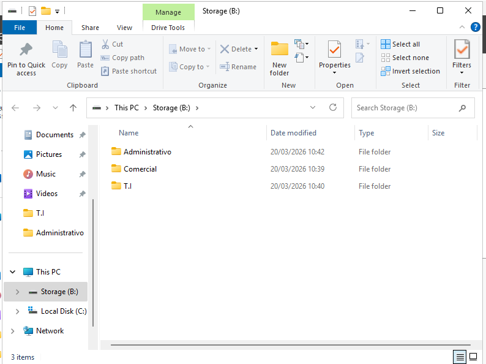

# Índice

- [1. O levantamento de requisitos estabelece a fundação da arquitetutura híbrida.](#sec-1)
- [2. A montagem do ambiente local estrutura a base física da rede](#sec-2)
- [3. Active Directory, DHCP e Segmentação de Rede](#sec-3)
- [4. Integração com a AWS](#sec-4)
- [7. Documentação da Infraestrutura](#sec-7)

# 📌 1. O levantamento de requisitos estabelece a fundação da arquitetutura híbrida.

Implementação de uma infraestrutura de **Cloud Híbrida**, integrando ambiente **on-premises** com a nuvem 

O cenário simula uma pequena empresa com usuários internos, acesso remoto seguro e integração com a nuvem para backup e continuidade do negócio.

---

## 🏢 Ambiente Local (On-Premises)

- 13 estações integradas ao domínio  
- 3 impressoras de rede  
- 1 servidor **Windows Server 2022**  
- **Active Directory**  
- File Server com controle de permissões  
- Autenticação e gerenciamento centralizado de usuários  

Responsável por identidade, autenticação e armazenamento principal de arquivos.

## ☁️ Estimativa de Custos - AWS

Esta seção apresenta a estimativa de custos para utilização da infraestrutura em nuvem na **Amazon AWS**, considerando os principais serviços utilizados no cenário híbrido.

---

### 💰 Resumo Geral

| Tipo de Custo           | Valor (USD) | Valor (BRL) |
|------------------------|-------------|-------------|
| Custo inicial          | 0,00        | R$ 0,00     |
| Custo mensal           | 38,22       | R$ 198,74   |
| Custo anual (12 meses) | 458,64      | R$ 2.384,93 |

> Cotacao de referencia utilizada: **1 USD = R$ 5,20**.

> 💡 Não há custos iniciais. O modelo segue o padrão **pay-as-you-go** da AWS.

---

### 📦 Serviços Utilizados

#### 🌐 Amazon VPC (Virtual Private Cloud)

| Item              | Detalhes                    |
|-------------------|----------------------------|
| Custo mensal      | 26,07 USD                  |
| Custo mensal (BRL)| R$ 135,56                  |
| Região            | América do Sul (São Paulo) |
| Conexões VPN      | 15 Site-to-Site            |
| Dias considerados | 22 dias úteis/mês          |

Responsável pela criação da rede virtual na nuvem, permitindo comunicação segura entre o ambiente **on-premises** e a AWS.

---

#### 🗄️ Amazon S3 (Simple Storage Service)

| Item              | Detalhes                    |
|-------------------|----------------------------|
| Custo mensal      | 12,15 USD                  |
| Custo mensal (BRL)| R$ 63,18                   |
| Região            | América do Sul (São Paulo) |
| Armazenamento     | 300 GB (S3 Standard)       |

Utilizado para armazenamento de backups e dados, garantindo alta durabilidade e disponibilidade.

---

### 📊 Estimativa Visual

🔗 **Estimativa detalhada no AWS Pricing Calculator:**
[Acessar simulação de custos](https://calculator.aws/#/estimate?id=3669f4422e66cd01dd7ee7429bf5589141411c06)

---

### 📌 Observações

- Os valores são estimativas e podem variar conforme o uso real.
- Custos adicionais podem surgir com:
  - Transferência de dados
  - Requisições ao S3
  - Expansão da infraestrutura

---

## 🌐 Acesso Remoto

### 👤 Usuário 1 – VDI
- Acesso via **Virtual Desktop Infrastructure (VDI)**  
- Processamento no ambiente local  
- Conexão segura via **FortiClient VPN**  

### 👤 Usuário 2 – VPN
- Acesso remoto à rede corporativa  
- Autenticação via domínio  
- Conexão segura com **FortiClient VPN**  

---

## ☁️ Integração com AWS

- Conectividade entre rede local e VPC na AWS  
- Backup em nuvem  
- Suporte à continuidade do negócio  
- Expansão futura para novos serviços  

Comunicação via **VPN Site-to-Site**, garantindo tráfego seguro entre os ambientes.

---

# 📌 2. A montagem do ambiente local estrutura a base física da rede

O laboratório representa uma arquitetura de infraestrutura híbrida integrando ambiente local (on-premises), usuários remotos e ambiente em nuvem.

A topologia foi projetada para simular o funcionamento de uma pequena empresa com controle centralizado, monitoramento, acesso remoto seguro e integração com cloud computing.

---

## 🏢 Ambiente Local (On-Premises)

A infraestrutura interna é composta por:

### 🔹 Servidor Principal

- **Windows Server 2025**
- Controlador de Domínio
- Gerenciamento de usuários e dispositivos
- Controle de permissões e autenticação centralizada

### 🔹 Servidor de Monitoramento

- Monitoramento da rede
- Monitoramento de servidores
- Supervisão de disponibilidade dos serviços

### 🔹 Rede Interna

- **Switch1** (conectando servidores)
- **Switch2** (conectando usuários)
- 13 estações de trabalho
- 3 impressoras de rede
- Firewall **F1**
- Roteador **R1**

O tráfego interno passa pelo firewall antes de sair para a internet, garantindo controle, inspeção e segurança da comunicação.

# 3. Active Directory, DHCP e Segmentação de Rede

O **:contentReference[oaicite:0]{index=0}** centraliza o controle de acesso e a gestão de identidades dentro da infraestrutura.

O serviço de **DHCP** foi centralizado no **Windows Server**, permitindo integração direta com o Active Directory e o **DNS**, garantindo automação, consistência e facilidade na administração da rede.

---

## 🌐 Configuração do DHCP (Segmentação por VLANs)

### 🔹 T.I – VLAN 10 (/26 – 62 hosts)

- Rede: `192.168.10.0`
- Máscara: `255.255.255.192`
- Gateway: `192.168.10.1`
- Primeiro Host: `192.168.10.1`
- Último Host: `192.168.10.62`
- Broadcast: `192.168.10.63`

---

### 🔹 Administração – VLAN 20 (/26 – 62 hosts)

- Rede: `192.168.10.64`
- Máscara: `255.255.255.192`
- Gateway: `192.168.10.65`
- Primeiro Host: `192.168.10.65`
- Último Host: `192.168.10.126`
- Broadcast: `192.168.10.127`

---

### 🔹 Comercial – VLAN 30 (/26 – 62 hosts)

- Rede: `192.168.10.128`
- Máscara: `255.255.255.192`
- Gateway: `192.168.10.129`
- Primeiro Host: `192.168.10.129`
- Último Host: `192.168.10.190`
- Broadcast: `192.168.10.191`

---

### 🔹 CFTV (Infraestrutura) – VLAN 40 (/28 – 14 hosts)

- Rede: `192.168.10.192`
- Máscara: `255.255.255.240`
- Gateway: `192.168.10.193`
- Primeiro Host: `192.168.10.193`
- Último Host: `192.168.10.206`
- Broadcast: `192.168.10.207`

---

### 🔹 Access Point – VLAN 50 (/28 – 14 hosts)

- Rede: `192.168.10.208`
- Máscara: `255.255.255.240`
- Gateway: `192.168.10.209`
- Primeiro Host: `192.168.10.209`
- Último Host: `192.168.10.222`
- Broadcast: `192.168.10.223`

---

## 🖥️ DHCP em Funcionamento

---

## 👥 Grupos de Usuários (Active Directory)

Foram criados grupos para organização e controle de acesso por setor:

- `GRP-ADM`
- `GRP-COM`
- `GRP-TI`

---

## ⚙️ Políticas de Grupo (GPO)

Foram criadas **GPOs (Group Policy Objects)** para aplicar configurações e restrições específicas por setor:

- ADM
- COM
- TI

---

## 🖥️ Virtualização (Hypervisor)

Foi criado um ambiente de virtualização utilizando um hypervisor para simular o ambiente on-premises, com uma máquina rodando **:contentReference[oaicite:1]{index=1}**.

## 📁 Estrutura de Pastas

| Caminho | Conteúdo |
|---|---|
| `D:\Storage` | Raiz dos compartilhamentos da empresa |
| `D:\Storage\TI` | `Documentacao` `Scripts` `Projetos` `Sistemas` `BACKUP_TI` |
| `D:\Storage\Administrativo` | `Financeiro` `Contratos` `Relatorios` `RH` `BACKUP_ADM` |
| `D:\Storage\Comercial` | `Propostas` `Clientes` `Vendas` `Marketing` `BACKUP_COM` |

## 🔐 Ingresso no Domínio

Para garantir padronização, segurança e aplicação centralizada de políticas, todas as máquinas foram ingressadas no domínio corporativo.

Com isso, os dispositivos passaram a herdar automaticamente as **GPOs**, permissões e configurações integradas ao ambiente local e à AWS.

### 📌 Diretrizes de Uso

- **Arquivos em uso** → Devem permanecer nas pastas principais
- **Arquivos importantes/finalizados** → Devem ser movidos para as pastas de **BACKUP**

---

#  4. Integração com a AWS

Foi criado um serviço de IAM para definir os seguintes usuários:

| Setor | Quantidade | Usuários |
|---|---:|---|
| 👨‍💻 TI | 5 | `ti-joao` `ti-maria` `ti-carlos` `ti-ana` `ti-lucas` |
| 🏢 Administrativo | 4 | `adm-bruna` `adm-ricardo` `adm-patricia` `adm-fernando` |
| 💼 Comercial | 4 | `com-gabriel` `com-juliana` `com-rodrigo` `com-carla` |

# 🔐 AWS Site-to-Site VPN - Documentação

## 📌 Visão Geral
Configuração de uma VPN Site-to-Site (IPsec) na AWS, conectando uma infraestrutura on-premises a uma VPC de forma segura, com roteamento estático.

---

## 🧱 Arquitetura

- **Cloud Provider:** AWS  
- **Tipo de VPN:** Site-to-Site (IPsec)  
- **Roteamento:** Estático  

### 🌐 Redes

| Ambiente     | CIDR            |
|--------------|-----------------|
| On-Premises  | 192.168.10.0/24 |
| AWS (VPC)    | 10.0.0.0/16     |

---

## 🔑 Componentes

### 🔹 VPC
- **ID:** vpc-02c21828c7384720d  
- **CIDR:** 10.0.0.0/16  

### 🔹 Virtual Private Gateway (VGW)
- **ID:** vgw-0e95cc065d3ebba4b  
- **Associado à VPC:** Sim  

### 🔹 Customer Gateway (CGW)
- **ID:** cgw-0d5a645e1eb31f33b  
- **IP Público:** 200.200.200.1  

### 🔹 VPN Connection
- **ID:** vpn-03a27b7c634bdfc2b  
- **Tipo:** ipsec.1  
- **Estado:** Disponível  
- **Autenticação:** PSK (Pre-Shared Key)  
- **Túneis:** 2 (Alta Disponibilidade)  

Destino: 192.168.10.0/24 → Target: vgw-0e95cc065d3ebba4b

### 📍 On-Premises

Destino: 10.0.0.0/16 → Gateway: VPN Tunnel

## 🔐 Parâmetros de Segurança

- **Protocolo:** IPsec  
- **Criptografia:** Negociada via IKE  
- **Autenticação:** PSK  
- **Portas:**
  - UDP 500 (IKE)  
  - UDP 4500 (NAT-T)  

  

---

## 🔐 Túneis VPN

### 🔹 Tunnel 1
- **IP Externo AWS (Peer):** 3.149.52.192  
- **IP Externo Local:** 200.200.200.1  
- **CIDR Interno:** 169.254.42.52/30  

---

### 🔹 Tunnel 2
- **IP Externo AWS (Peer):** 3.150.152.161  
- **IP Externo Local:** 200.200.200.1  
- **CIDR Interno:** 169.254.19.20/30  

## 🔄 Roteamento

### 📍 AWS (Route Table)

#  7. Documentação da Infraestrutura

Abaixo estão os documentos contendo a configuração de rede da infraestrutura, incluindo endereçamento IP, máscaras, VLANs e serviços utilizados na nuvem.

## 🖥️ 1. T.I
[Acessar documentação](https://docs.google.com/spreadsheets/d/1f2WQca90ACLv3GuLH0KYVGViBtsSL65fSalYwBg82h4)

---

## 🏢 2. Administrativo e Financeiro
[Acessar documentação](https://docs.google.com/spreadsheets/d/1Y4ezoiYASlpmDFKRiA7Twg4ZmpV_E8Edw6SvxeivWx0)

---

## 💼 3. Comercial
[Acessar documentação](https://docs.google.com/spreadsheets/d/1qgJGADnT86ZqXFpUzhB9_cyiJ_ikbbdWk6wVV047_fI)

---

## 🏗️ 4. Infraestrutura Isolada
[Acessar documentação](https://drive.google.com/file/d/1bX4C4a2ECAayJ-Dx55k4SIlZ3QC6ihVG/view)

---
